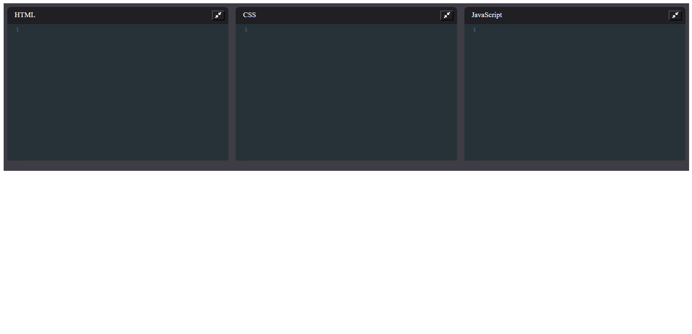

# i-code-writer

i-code-writer is a web-based code editor that allows users to write and preview HTML, CSS, and JavaScript in real time. It also utilizes **localStorage** to automatically save user progress.

## Live Demo
[Access the app here](https://i-code-writer.netlify.app)

## Screenshot

## Features
- **Live Preview**: Instantly renders the DOM created by the user’s code.
- **Supports HTML, CSS & JavaScript**: Provides a seamless coding experience.
- **Auto-Save with LocalStorage**: Keeps track of your progress, so you never lose your work.
- **Built with React**: Ensures a smooth and responsive interface.

## Technologies Used
- **React, Code Mirror**  
- **HTML, CSS, JavaScript**  
- **LocalStorage API**  

